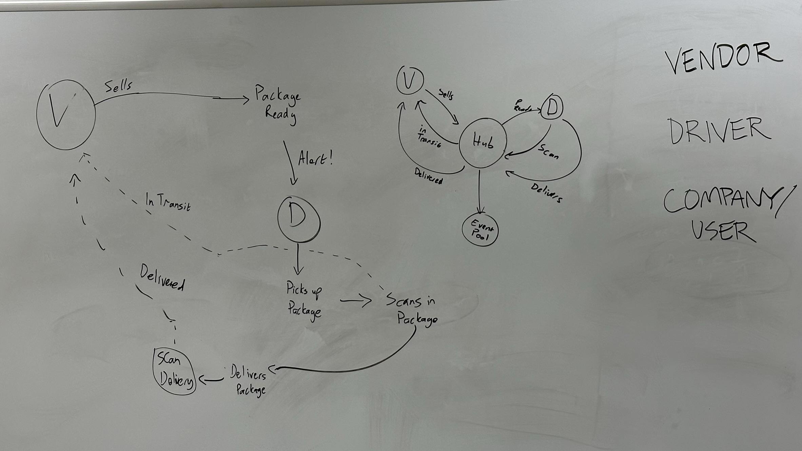
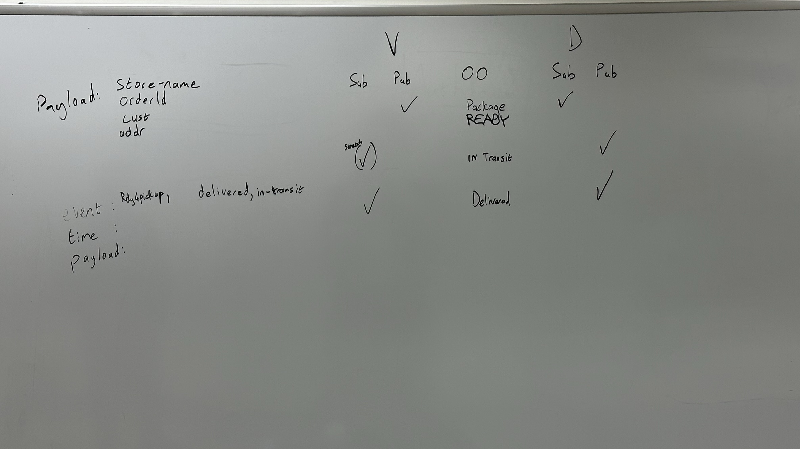

# parcel-service
A real-time service that allows for vendors, such as flower shops or restaurants, to alert a system of a package needing to be delivered, for drivers to instantly see what’s in their pickup queue, and then to alert the vendors as to the state of the deliveries (in transit, and then delivered).

## Setup
- .env  requirements
  - PORT: Port Number to run server
  - DATABASE_URL: db connection string (defaults to sqlite if this isn't present)

## Running the app
- to install:
  - `npm install`
- to run:
  - `npm run dev`

## Tests
- Unit Tests: `npm run test`

## UML

